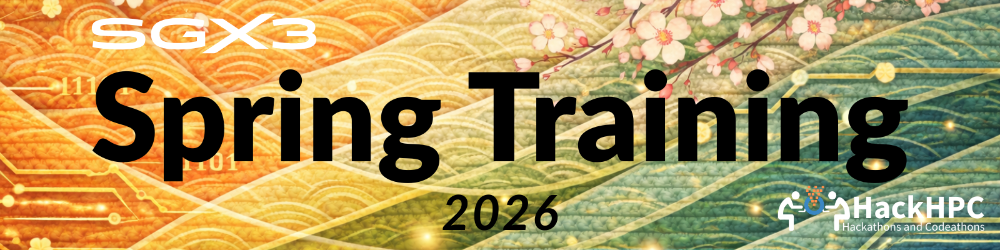

The SGX3 Spring 2026 Training Program is intentionally structured as an invitation-only experience, open exclusively to students who demonstrated exceptional performance in a prior SGX3 training cohort. This advanced format recognizes their readiness to move beyond skill acquisition and into applied research contribution.

Rather than multiple exploratory exercises, the Spring program centers on a single, cohesive research project that the cohort will collaboratively design, implement, refine, and document over the course of the semester. Students will operate as a small research team—mirroring real-world academic and national-lab project environments—where ownership, accountability, and interdisciplinary thinking are core expectations.

## From Training to Contribution

The defining objective of the Spring 2026 cohort is translation: transforming technical training into scholarly output. The selected research project will culminate in a formal presentation at the ADMI 2026 Conference, held March 26–29, 2026 in Orangeburg, South Carolina.

This milestone elevates the program from a learning experience to a professional research engagement, giving students firsthand exposure to:

- Research framing and problem definition
- Collaborative computational workflow development
- Reproducibility and documentation standards
- Abstract development and conference presentation practices
- Communicating technical work to an academic audience

Participation in the conference anchors the Spring program in authentic academic practice, reinforcing that advanced cyberinfrastructure skills are not ends in themselves—but tools for impact, scholarship, and leadership.

## A Capstone Experience

In contrast to the broad survey approach of the Fall program, Spring 2026 functions as a capstone, designed for students ready to demonstrate mastery, initiative, and professional growth. By the program’s conclusion, participants will have contributed to a tangible research outcome, presented their work publicly, and positioned themselves competitively for graduate study, internships, and research-oriented careers.
